# 147,734 → 1,110 cycles: an optimization journey

How we took Anthropic's VLIW/SIMD performance take-home from its naive
baseline to **133× faster** — 26 logged steps, eight eras,
three regressions we kept on purpose, and a final wall that turned out to
be arithmetic rather than engineering.

| | |
|---|---|
| Baseline (as shipped) | 147,734 cycles |
| Final | **1,110 cycles** (133.1×) |
| Compute-work floor of the final algorithm | 1,077 cycles |
| Claude Opus 4.5 (11.5 h harness) | 1,487 |
| Best known AI result (improved harness) | 1,363 |

Canonical workload: `forest_height=10, n_nodes=2047, batch_size=256,
rounds=16` — 256 lanes, each descending a binary tree for 16 rounds,
re-hashing its value against the visited node at every level
(4,096 lane-rounds total). Scored by simulated cycle count on a frozen
simulator; correctness checked per round against the reference.

The full append-only history is in `notes/optimization_log.md`. This
document is the curated version: what we did, in what order, what it
taught us, and what we deliberately left undone.

## The machine in 6 bullets

1. One in-order VLIW + SIMD core. A program is a list of **bundles**; a
   bundle costs 1 cycle if it has any non-debug slots.
2. Per-cycle slot limits: **alu 12 · valu 6 · load 2 · store 2 · flow 1 ·
   debug 64**. The whole game is filling these.
3. One flat **1,536-word scratch** is the register file; a "vector
   register" is 8 contiguous words. 1536 = 192 eight-word granules; after
   the scalar pool and one pinned constant, ~185 are usable for vectors.
   That number drives the second half of the story.
4. **Read-before-write**: every slot in a bundle reads pre-cycle state;
   writes commit at end of cycle. So a consumer can never share a bundle
   with its producer — every dependency costs ≥ 1 cycle.
5. All arithmetic mod 2³²; `multiply_add` (a×b+c) exists as a **valu**
   op; there is **no gather/scatter** instruction (loads are scalar, 2 per
   cycle). Debug-only bundles cost 0 cycles — a free oracle.
6. `N_CORES = 1`, intentionally.

## The map

```mermaid
flowchart TB
  classDef P fill:#d6e6f5,stroke:#1f77b4,color:#111
  classDef S fill:#ffe6cc,stroke:#e08000,color:#111
  classDef M fill:#d9f0d9,stroke:#2ca02c,color:#111
  classDef R stroke:#d62728,stroke-width:3px

  subgraph E1["era 1 - naivete removal"]
    direction LR
    s0["baseline<br/>147,734"]
    s1["12-slot hash<br/>123,165"]
    s2["scratch-resident<br/>77,223"]
    s3["8-lane vector<br/>12,911"]
    s0 --> s1 --> s2 --> s3
  end
  subgraph E2["era 2 - VLIW packing"]
    direction LR
    s4["DAG packing<br/>2,394"]
    s5["greedy pick<br/>2,236"]
    s6["tree preload<br/>2,049"]
    s7["preload 11-13<br/>1,799"]
    s8["per-group temps<br/>1,773"]
    s4 --> s5 --> s6 --> s7 --> s8
  end
  subgraph E3["era 3 - priority-as-ML"]
    direction LR
    s9["weighted picker<br/>1,599"]
  end
  subgraph E4["era 4 - structural investments"]
    direction LR
    s10["epilogue overlap<br/>1,546"]
    s11["addr-scheme<br/>1,559"]
    s12["path-bit carry<br/>1,535"]
    s10 --> s11 --> s12
  end
  subgraph E5["era 5 - re-training on the new DAG"]
    direction LR
    s13["trained weights<br/>1,522"]
    s14["+idx property<br/>1,459"]
    s15["DCE<br/>1,458"]
    s13 --> s14 --> s15
  end
  subgraph E6["era 6 - regalloc rehaul"]
    direction LR
    s16["two-phase regalloc<br/>1,628"]
    s17["freeing bias<br/>1,466"]
    s18["rollout<br/>1,413"]
    s19["group dial<br/>1,289"]
    s16 --> s17 --> s18 --> s19
  end
  subgraph E7["era 7 - op-floor grind"]
    direction LR
    s20["prologue merge<br/>1,203"]
    s21["computed consts<br/>1,190"]
    s22["path-bit retention<br/>1,179"]
    s23["valu-alu swap<br/>1,174"]
    s24["weight training<br/>1,119"]
    s25["dynamic alloc<br/>1,117"]
    s20 --> s21 --> s22 --> s23 --> s24 --> s25
  end
  subgraph E8["era 8 - the L0 saga"]
    direction LR
    s26["L0-direct + interp<br/>1,110"]
  end
  floor["compute floor<br/>1,077"]

  s3 --> s4
  s8 --> s9
  s9 --> s10
  s12 --> s13
  s15 --> s16
  s19 --> s20
  s25 --> s26
  s26 -.->|"33 cyc slack"| floor

  class s0,s1,s2,s3,s7,s10,s11,s12,s15,s20,s21,s22 P
  class s4,s5,s8,s9,s13,s14,s16,s17,s18,s19,s23,s24,s25 S
  class s6,s26 M
  class s11,s16 R
  style floor fill:none,stroke:#7b2d8e,stroke-dasharray:5 5,color:#7b2d8e
```



Blue = program-side, orange = scheduler-side, green = mixed; red border =
a regression we kept deliberately (L0-direct, the third, was a parked
toggle rather than a shipped regression). The quantitative log-scale
version of this chart is `journey.png`.

Every step is tagged **program-side** (changes what work exists — the op
DAG) or **scheduler-side** (changes where/when work lands — placement,
allocation, priority). Red circles are regressions we kept deliberately.

The single best summary of the journey: **the bottleneck kept migrating**.
Each era below ends by naming the wall it hit - which became the next
era's target. Eras are strictly chronological.

## What went into the final design

Before the narrative: the inventory of what actually ships, so readers
can map each idea to where it landed.

### Program side — the DAG that gets scheduled

Every round, per lane-group: **gather-or-select → entry XOR
(`val ^= node_val`, 1 valu) → 12-slot hash → 3-op address update**. The
bullets detail each piece:

- **12-slot vectorized hash** (the verified minimum; alternative fusions
  numerically falsified): three linear
  `a*(1+2^s)+K` stages collapsed to one `multiply_add` each; three
  xor/add-shift stages at 3 slots each (carries block fusing).
  8 lanes per valu op, 32 lane-groups. `val` doubles as the running hash
  register — the final stage writes `v` in place, zero copy-out.
- **Scratch-resident state**: `val` vloaded once, vstored once; no
  per-round memory round-trips.
- **Branchless descent storing tree *addresses*, not indices**:
  `next = 2·addr + (1−forest_p) + (v&1)`; the wrap is a build-time
  decision (all lanes provably at the same level each round; wrap lands
  exactly on round 10).
- **Path bit carried in a temp register** doubles as the next round's
  select bits: round r's address update writes the descent direction
  `v&1`, and since idx = 2·idx_prev + 1 + (v&1), that bit IS the
  level-1 select bit (idx = 1 + path) and the level-2 low bit — no index
  recovery needed.
- **Tree levels 0–3 preloaded** and reached by `vselect` chains instead
  of gathers (both descents) — level L costs 2^L−1 vselects, so
  64 group-rounds x (0+1+3+7) = 704 (+2 pause slots) on the single flow
  port, its only real load; level 0's entry XOR reads the `tree[0]` broadcast
  constant **directly**, deleting the per-group copy op (the L0-direct
  cut); level 3 consumes path bits
  **retained** from the descent rather than recomputed.
- **Tree-value lookups can't be vectorized** — the ISA has no gather
  instruction — so each group's lookup is 8 scalar loads, one per lane,
  reading the per-lane **stored address directly** (no per-round
  address-add anywhere). 8 gather rounds x 32 lane-groups = 256 lookups
  = 2,048 of the 2,133 loads that set the load-port floor.
- **Zero-initialized scratch exploited**: the zero constant vector is
  pinned at granule 0 and needs no write; the initial index plane needs
  no init.
- **Prologue merged into the body DAG** (constants computed from each
  other on valu; setup interleaves with early compute); the two
  correctness-barrier pauses ride flow slots of existing bundles (0-cycle
  at grading); **epilogue vstores overlap the body tail** via independent
  per-group output addresses.

### Representation — the IR that enables everything below

- **Typed instruction layer** (`ir.py`): every op is a small dataclass
  that knows its engine, its reads/writes, and how to lower to a
  simulator slot tuple. The kernel builder programs against this IR,
  not raw slot tuples.
- **Symbolic operands**: operands are declared symbols (`Sym`) and lane
  views (`LaneRef`), translated to physical addresses (`Reg`) only at
  placement time. This is the change that makes register renaming and
  dynamic allocation *mappings rather than rewrites* — and what makes
  the RAW-only DAG clean: SSA-style version tags (each write gets a
  unique name) can name every write because writes are symbols.
- A **Gather is one IR node** — scheduled as a single partial-completion
  node and decomposed by the scheduler into 8 scalar loads.
- Introduced between steps 15 and 16 in four commits each verified
  byte-identical against the previous program. Zero cycle delta — which
  is why the cycle-centric log skipped the most load-bearing refactor of
  the project entirely.

### Scheduler side — how the DAG lands

- **Two-phase register allocation**: SSA tag chains → a **RAW-only DAG**
  (no false WAR/WAW dependencies *by construction*) → registers allocated
  at placement time, freed when the last reader commits. One vector free
  list over all of scratch; scalars split granules on demand; cycle-end
  garbage collection.
- **Dead-code elimination**: prune everything not RAW-reachable from the
  32 final stores.
- **Rollout list scheduler** with per-cycle checkpoint/rollback (built
  for trial-and-score search) — shipped at **K=1**, greedy priority only,
  because the priority function alone meters register pressure.
- **Progress-interpolated weighted priority**: per-node static props
  (dist-to-sink, dist-to-load, rigidity, DAG-derived lane-group) plus a
  live register-freeing bias. The trained structure (values in
  `perf_takehome.py`): **early** — serialize early lane-groups hard
  (group −4.8) to stagger the descent wavefront; **late** — group dial
  off, register discipline (freeing ~7–8) throughout.
- **Engine elasticity**: vector ops prefer valu, spill to alu (sticky);
  a rigid fma finding valu full can evict a valu-placed elementwise op
  down to alu mid-cycle (1 valu ↔ 8 alu lane-slots).

### The numbers

| quantity | value |
|---|---|
| total compute work | 64,578 lane-slots → **floor 1,077** (60/cyc) |
| total loads | 2,133 → floor ~1,067 (2/cyc) |
| schedule achieved | **1,110** = floor + 33 |
| slack composition | ramp-up latency (~4, irreducible), round-15 gather-feed wall, tail drain |

## The eight eras

### 1. Naïveté removal — 147,734 → 12,911 (steps 1–3)

The shipped kernel rereads and rewrites memory every round, does the hash
as 18 literal scalar ops, and uses one slot per bundle. We collapsed the
hash to 12 slots (three stages are affine and fuse into `multiply_add`;
three aren't, and we *falsified* the fusion numerically before accepting
that), made lane state scratch-resident, made the descent branchless, and
vectorized 8 lanes per op under a strict SoA scratch layout.

- **Wall**: none left in the instruction stream — but it was all still
  one-slot-per-bundle.
- **Lesson**: count slots before scheduling them. PMU instrumentation
  showed 6.7% alu utilization; the problem was never "scheduling".

### 2. VLIW packing — 12,911 → 1,773 (steps 4–8)

A DAG builder (RAW = read-after-write true dependencies, weight 1;
WAR = write-after-read register-reuse orderings, weight 0) and a list
scheduler to
pack bundles. The era's real discovery was that **register reuse is part
of the program's dependency structure**: three shared temporaries formed
cross-group WAR chains that made the *loop nest order* a 4× difference in
the readiness lower bound. Making temporaries per-group (op-neutral, zero
scratch cost) removed the false chains and made loop order irrelevant.
Also here: preloading tree levels 0–2 and replacing gathers with select
chains (program-side), and the first hint that picker choice matters —
all deterministic pickers landed ~1,822 while a lucky random seed hit
1,773.

- **Wall**: the gather. 2,560 scalar loads / 2 ports = a hard 1,280-cycle
  load floor.
- **Lesson**: when the same DAG schedules 4× apart, the missing
  dependency information is in register naming, not in the scheduler.

### 3. Priority-as-ML — 1,773 → 1,599 (step 9)

All deterministic pickers clustered at ~1,822 while a fixed-seed random
shuffle hit 1,773 — proof the picker mattered and that we had no good
theory for it. Replaced hand-chosen heuristics with a **weighted sum
over static node properties** (dist-to-sink, dist-to-load, RAW/WAR
fan-out, rigidity), with weights found by random search. First surprise:
the trained weights had **negative** sink and raw weights —
*deprioritizing* the critical path in a throughput-bound schedule.

- **Wall**: the picker was now a trained function — but only as good as
  the DAG it was trained on. Era 4 changed the DAG.
- **Lesson**: the priority is a trainable function, not a design
  decision. Its weights are parameters to be optimized, and their signs
  will surprise you.

### 4. Structural investments — 1,546 → 1,535, via 1,559 (steps 10–12)

One of the three "kept regressions" lives here. Storing tree **addresses**
instead of indices removed the per-round gather address-add (−704 nodes,
−7 critical path) but *cost* 13 cycles the day it landed — the removed
adds had been hiding behind loads, and the select rounds suddenly needed
index recovery. It was kept for the structure, and the next step
(path-bit carry + address-compare selects) eliminated the recovery and
put the scheme ahead on every metric. Meanwhile overlapping the epilogue vstores
into the body tail (using the store engine that sat idle for ~1,400
cycles) was the era's free −52.

- **Wall**: register pressure, lurking. WAR edges jumped +6,208 with the
  address scheme; the scratch file has 185 granules.
- **Lesson**: a regression is an investment when you can name the asset
  bought (here: −704 nodes and a 7-shorter critical path).

### 5. Re-training on the new DAG — 1,535 → 1,458 (steps 13–15)

Era 4's new DAG needed new weights. Proper training (coordinate descent
with restarts over the step-12 DAG) gave −13; then the five-property
space plateaued at 1,514 until a sixth property — program-order `idx`,
weight −4, i.e. reverse program order — broke it for another −55.
Second surprise: the biggest single dial was one we had used only as a
tiebreaker. The era closed with a prune-to-stores dead-code pass (step
15): −1 cycle, but clean sink anchoring for the picker properties.

- **Wall**: schedule quality was now good enough that cycle count stopped
  being an honest metric for structural changes.
- **Lesson**: retrain after every DAG change — weights overfit the
  structure they were found on. And when the trainer is the bottleneck,
  judge program changes by DAG quality (nodes/height/edges), not by the
  cycles an untrained picker happens to find. ("Structure is honest
  where the untrained picker's cycle count is not.")

### 6. The register-allocation rehaul — 1,458 → 1,289 (steps 16–19)

The biggest single change, and the deepest regression. It began with
the IR runway described above: four byte-identical commits that changed
*nothing* about the emitted program, so that naming could be separated
from placement. The first behavior-changing step — the one-pass FIFO
rename engine with auto-freed shared tags — silently broke ordering
chains (a dead write broke the reader-bridged WAW chain), and its
replacement —
SSA tag chains producing a **RAW-only DAG**, with registers allocated at
placement time — landed at 1,628 against the then-best 1,458. Kept
deliberately: unique version tags eliminate false dependencies *by
construction*, which is the property everything later depends on. Under
real pressure the scheduler now deadlocked (free pool = 0 with only
writers ready), which forced two more inventions: the **rollout
scheduler** (per-cycle trial orderings with checkpoint/rollback, scored
on post-cycle state) and **DAG-derived sink groups** with a group
priority dial — the discovery that serializing chain *openings* meters
register pressure (−124 cycles from one weight).

- **Wall**: the load port at 97.6% utilization (step 17); valu becomes
  the wall at 95.2% once the prologue merge packs compute tighter
  (step 20). The endgame had begun.
- **Lesson**: separate *naming* from *placement*. And register pressure
  is a scheduling constraint to be metered continuously, not an
  emergency to be survived.

### 7. The op-floor grind — 1,289 → 1,117 (steps 20–25)

With scheduling machinery stable, a sequence of small structural cuts:
merging the prologue into the body DAG (−86; setup work interleaves with
early compute, pauses ride free on flow slots), computing small constants
from each other instead of loading them (−13), retaining path bits
instead of recomputing (−11), the valu→alu eviction swap (−5),
industrialized weight training with a trimmed sign-free space (−55), and
dynamic scalar/vector granule allocation (−2). Each small; all required
the two-phase machinery to land.

- **Wall**: the valu op floor itself (~1,085). The 12-slot hash, entry
  XOR, and 3-op address update were all at verified minimums.
- **Lesson**: when the compute and load engines all run >88% busy, only
  op-count moves the floor — and the scheduler's job is to stay out of
  the way.

### 8. Industrialized search and the L0 saga — 1,117 → 1,110 (step 26,
building on step 24's training infra)

The last op cut was measured and *parked*: deleting 64 pure-copy valu
ops (level-0 `node_val` reads the tree constant directly) lowered the
floor by ~10 but made schedules *worse* — the copies had been acting as a
pacemaker. With a parallelized trainer (~25× throughput) we could finally
afford to investigate properly. Profiling classified every underfilled
cycle as **register pressure vs work starvation** and located the real
mechanism: not the ramp-up flood we'd assumed, but the **round-15 gather
wall** — a gather feeds a group every 4 cycles (8 loads / 2 ports) while
its hash drains every 2.3 (14 valu / 6), so synchronized group arrivals
starve valu *arithmetically*. The copies had been keeping groups
phase-spread. Trend analysis of ~4,000 trained configs then reshaped the
search space (one inert property dropped, sign-biased bounds, a
base+tilt parameterization of the interpolation), and the denser search
found a new basin that re-creates the stagger by priority alone:
**serialize early groups early, release late**. Shipped at 1,110.

- **Wall**: feed-rate arithmetic (gather feed 4 cyc/group vs hash drain
  2.3 cyc/group) plus ramp-up latency. The remaining 33-cycle slack is
  mostly not recoverable by scheduling.
- **Lesson**: measure the *nature* of the slack before throwing search at
  it. One-step scheduling search cannot recover a feed-rate wall felt a
  hundred cycles after the decisions that caused it.

## The taxonomy

**Program-side vs scheduler-side** — see the map. Roughly: program-side
owned the first 12× (down to ~12,911) and the op-floor grind;
scheduler-side owned the 5× in between and the pressure endgame; the
last wins needed both at once.

**Kept regressions** (3): addr-scheme (+13 the day it landed, paid off
next step), the two-phase regalloc (+170, foundation of everything
after), L0-direct (measured worse, parked with a mechanism hypothesis,
shipped the next step - a parked toggle rather than a shipped
regression, hence no red circle on the chart).

**Superseded but not wasted** (the graveyard): the lucky-random picker
(motivated weighted search); our hand-tuned sign intuition, wrong
repeatedly (negative sink in step 9, positive group in step 24,
early-serialize/late-release in step 26 were all *found by search*, not
proposed by us); the `idx=-4` breakthrough
(plateau-breaker, later trimmed — it was proxying for weight regions the
biased sweep couldn't reach); the FIFO rename engine (the IR's first
allocator, superseded by the two-phase scheme); K=6 rollout trials
(the group dial made K=1 sufficient, 5× faster); the first interp
parameterization (the base+tilt reparameterization fixed what raw
12-dim search couldn't sample).

**Detours that paid**: the 4× loop-order anomaly (became the per-group
temporaries insight); the big-scratch validation harness (not a grading
tool — it enabled a correct-before-fit workflow that de-risked every
structural change after); the rollout machinery (built to survive
deadlock, became the platform the whole endgame runs on).

**The disciplined "no"**: K=N trial scoring with a trained scorer, and
multi-cycle horizon search — both analyzed to a quantified bound (a
~33-cycle pot, mostly the feed wall, which one-step scoring cannot
address) and consciously deferred. Knowing what not to build is part of
getting to 1,110.

## What's left on the table

1. **The dedup lever** — the only big pot remaining. Identical
   `(idx, val)` lanes hash identically; fewer than 4,096 hashes (or a
   sub-12-slot hash) is the only route below the 1,077 floor. Untouched.
2. **K=N with a trained scorer** — bounded upside within the 33-cycle
   slack; evidence says it cannot fix the round-15 feed wall.
3. **The feed wall itself** — needs a structural answer (cheaper gather;
   the ISA has none) or a scheduling "hold" DOF that idles slots to
   re-spread arrivals — expensive when both compute engines run at
   96–97%.

## Reproducing

```
python tests/submission_tests.py   # 1,110 cycles, all tiers, 8 seeds
python _check.py                   # per-round correctness oracle
python analyze_slots.py --show     # per-cycle engine utilization
```

The trained constants ship in `perf_takehome.py`
(`INTERP_W_EARLY`/`INTERP_W_LATE`); the training harness is
`train_weights.py`; per-step history with mechanisms and PMU tables is
`notes/optimization_log.md`.
