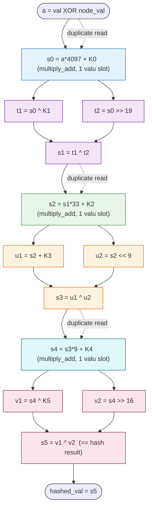

# myhash dependency graph (12-slot reduced form)

Reduced from the literal 18-slot form: stages 0, 2, 4 collapse to one
`multiply_add` each (`a*(1+2^s) + K`). Stages 1, 3, 5 are irreducible at 3
slots (xor/add-shift with `^` combine, can't fuse carries through XOR).

All constants (4097, 33, 9, K0..K5) live in scratch and are read read-only
(as operands to fma slots or alu slots); they're not on the critical path so
drawn as side inputs only at the fma/xor combine where needed.



## Critical path (chain length)

The hash is **6 stages deep, strictly sequential**: s0 → s1 → s2 → s3 → s4 → s5.
Each stage depends only on the previous stage's output. There is zero
cross-stage parallelism on the critical path.

Within-stage parallelism: stages 1, 3, 5 have 2 parallel transforms of the
previous stage output + 1 combine ⇒ stage latency = 2 cycles (issue the two
transforms in cycle N, the combine in cycle N+1). Stages 0, 2, 4 are 1 cycle
(fma).

Stage latencies and minimum requirement on cycles for **a single hash**:

| stage | slots | latency (cycles) |
|---|---|---|
| 0 (fma) | 1 | 1 |
| 1 (xor-shift) | 3 | 2 |
| 2 (fma) | 1 | 1 |
| 3 (add-shift ^) | 3 | 2 |
| 4 (fma) | 1 | 1 |
| 5 (xor-shift) | 3 | 2 |
| **total** | **12** | **9** |

Minimum latency for one hash (single lane): **9 cycles**. The slot count (12)
exceeds the latency (9) only in the 3 xor-shift stages where two reads go
parallel (3 slots, 2 cycles). For a single lane, this is the best you can do;
the densest packing fills 1-2 slots per cycle.

## Where scheduling matters: across the 256 lanes (batch dimension)

The 9-cycle critical path is per-lane. For 256 lanes vectorized as 32 vectors
of 8 lanes (or unrolled across 256 scalar lanes), the critical-path observation
that drives scheduling:

- The 3 fma stages (1 slot each) are sequential bottlenecks — both operands
  read the same `s_{i-1}`, so only 1 slot per cycle can do useful fma work on a
  given vector.
- The 3 xor-shift stages (3 slots, 2 cycles) have 2 wide-issue-op parallelism
  when you have spanning work: the two transforms (`a^K` and `a>>s`) issue in
  parallel in cycle N; the combine `^` issues in cycle N+1.

The critical-path depth (9) is much smaller than the slot count (12). So with
enough vectors in flight, the 12 slots can be packed densely — the design
question is how many vectors to issue in parallel per cycle to keep the 6 valu
slots + 12 alu slots saturated without over-scheduling the 9-cycle-critical-
path chain.

## Per-stage slot count summary

```
stage 0  fma           : 1 valu slot  (multiply_add: a*4097+K0)
stage 1  xor-shift     : 3 slots      (2 alu: a^K, a>>19; 1 alu/valu: ^)
stage 2  fma           : 1 valu slot  (multiply_add: s1*33+K2)
stage 3  add-shift xor : 3 slots      (2 alu: a+K, a<<9; 1 alu/valu: ^)
stage 4  fma           : 1 valu slot  (multiply_add: s3*9+K4)
stage 5  xor-shift     : 3 slots      (2 alu: a^K, a>>5; 1 alu/valu: ^)
-------------------------------------------------------------
total                  : 12 slots/frame    (3 fma + 9 xor/add-shift)
critical path          : 9 cycles/frame    (1 + 2 + 1 + 2 + 1 + 2)
```

The xor-shift stages can use **either alu or valu** for their elementwise
`^`, `<<`, `>>`, `+`. The fma stages are **valu only** (alu has no fma).
So slot partitioning:

- 3 fma slots MUST go to valu (3 of the 6 valu slots/cycle).
- 9 xor/shift slots can go to either valu or alu. To saturate both ports, send
  them to whichever has spare capacity. For per-lane (vectorized) work, valu
  is 8x more slot-efficient: 1 valu slot does 8 lanes, so prefer valu, use
  alu only when valu is fully booked this cycle.